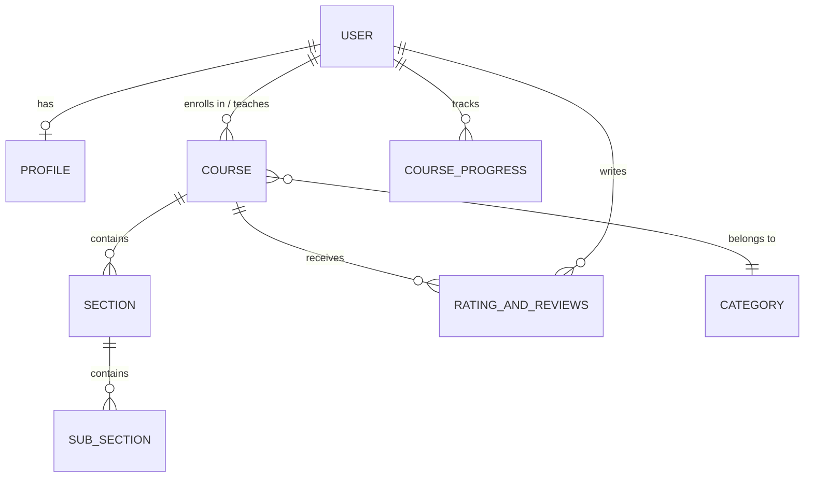

# 📚 Scholae — An EdTech Platform (Backend)

> A full-featured backend server for an online education platform where **Instructors** create courses, **Students** enroll and learn, and **Admins** manage the catalogue — built with Node.js, Express, and MongoDB.

Developed by **Rishikesh Kumar** under the guidance of Love Babbar (CodeHelp).

---

## ✨ Features

### 🔐 Authentication & Authorization
- **Signup** with OTP-based email verification (auto-generated via `otp-generator`)
- **Login** with JWT-based session tokens stored in cookies
- **Role-based access control** — three distinct roles:
  - `Student` — browse & enroll in courses, leave ratings
  - `Instructor` — create, edit & manage course content
  - `Admin` — manage course categories
- **Password reset** via secure tokenised email links
- **Change password** for logged-in users

### 🎓 Course Management
- Full **CRUD** operations on courses (create, read, update, delete)
- Hierarchical content structure: **Course → Sections → Sub-Sections**
- Course tagging, pricing, thumbnail, status (Draft / Published)
- Category-based organisation with detailed category pages
- Tracks students enrolled per course

### 💳 Payments (Razorpay)
- Integrated **Razorpay** payment gateway for course purchases
- Order creation (`capturePayment`) and signature verification (`verifySignature`)
- Students-only access with auth middleware

### ⭐ Ratings & Reviews
- Students can rate and review courses they've enrolled in
- Fetch average rating for any course
- Retrieve all reviews across the platform

### 👤 User Profiles
- Update profile details (about, date of birth, gender, contact number)
- Upload / update profile picture via **Cloudinary**
- Delete account
- Fetch complete user details with populated references

### 📧 Email Notifications
- Transactional emails powered by **Nodemailer** with rich HTML templates:
  - OTP verification email
  - Course enrollment confirmation
  - Password update notification
  - Contact form acknowledgement

### ☁️ Media Uploads
- Image and video uploads to **Cloudinary**
- File handling via `express-fileupload` with temp-file support

---

## 🛠️ Tech Stack

| Layer | Technology |
|---|---|
| **Runtime** | Node.js |
| **Framework** | Express.js v5 |
| **Database** | MongoDB (via Mongoose ODM) |
| **Authentication** | JSON Web Tokens (JWT) + bcrypt |
| **Payments** | Razorpay |
| **Media Storage** | Cloudinary |
| **Email** | Nodemailer |
| **File Upload** | express-fileupload |

---

## 📁 Project Structure

```
server/
├── config/
│   ├── cloudinary.js          # Cloudinary connection setup
│   ├── database.js            # MongoDB connection
│   └── razorpay.js            # Razorpay instance config
├── controllers/
│   ├── Auth.js                # Signup, Login, OTP, Change Password
│   ├── Category.js            # Create, list & detail categories
│   ├── ContactUs.js           # Contact form handler
│   ├── Course.js              # Full course CRUD
│   ├── Payments.js            # Razorpay capture & verify
│   ├── Profile.js             # User profile management
│   ├── RatingAndReviews.js    # Ratings & reviews logic
│   ├── ResetPassword.js       # Token-based password reset
│   ├── Section.js             # Course section CRUD
│   └── SubSection.js          # Sub-section CRUD
├── mail/
│   └── templates/
│       ├── contactFormEmail.js
│       ├── courseEnrollmentEmail.js
│       ├── emailVerificationTemplate.js
│       └── passwordUpdate.js
├── middlewares/
│   └── auth.js                # JWT auth + role guards (isStudent, isInstructor, isAdmin)
├── models/
│   ├── Category.js
│   ├── Course.js
│   ├── CourseProgress.js
│   ├── OTP.js
│   ├── Profile.js
│   ├── RatingAndReviews.js
│   ├── Section.js
│   ├── SubSection.js
│   └── User.js
├── routes/
│   ├── Course.js              # Course, Category, Section, Rating routes
│   ├── Payments.js            # Payment routes
│   ├── Profile.js             # Profile routes
│   └── User.js                # Auth & reset password routes
├── utils/
│   ├── imageUploader.js       # Cloudinary image upload helper
│   ├── mailSender.js          # Nodemailer send helper
│   └── videoUploader.js       # Cloudinary video upload helper
├── index.js                   # Express app entry point
├── package.json
└── .gitignore
```

---

## 🚀 Getting Started

### Prerequisites

- **Node.js** v18+ and **npm**
- **MongoDB** instance (local or [MongoDB Atlas](https://www.mongodb.com/atlas))
- **Cloudinary** account — [sign up free](https://cloudinary.com/)
- **Razorpay** account — [sign up](https://razorpay.com/)
- An email account for SMTP (Gmail, etc.)

### Installation

```bash
# Clone the repository
git clone git@github.com:rishi191800/scholae_an_edtech_platform.git
cd scholae_an_edtech_platform

# Install dependencies
npm install
```

### Environment Variables

Create a `.env` file in the root directory with the following variables:

```env
# Server
PORT=4000

# Database
DATABASE_URL=mongodb+srv://<username>:<password>@cluster.mongodb.net/scholae

# JWT
JWT_SECRET=your_jwt_secret_key

# Cloudinary
CLOUD_NAME=your_cloud_name
API_KEY=your_cloudinary_api_key
API_SECRET=your_cloudinary_api_secret

# Razorpay
RAZORPAY_KEY=your_razorpay_key_id
RAZORPAY_SECRET=your_razorpay_secret

# Email (SMTP)
MAIL_HOST=smtp.gmail.com
MAIL_USER=your_email@gmail.com
MAIL_PASS=your_email_app_password
```

### Run the Server

```bash
# Development (with hot-reload)
npm run dev

# Production
npm start
```

The server will start at **http://localhost:4000**.

---

## 📡 API Endpoints

### Auth (`/api/v1/auth`)

| Method | Endpoint | Access | Description |
|---|---|---|---|
| POST | `/signup` | Public | Register a new user |
| POST | `/login` | Public | Log in and receive JWT |
| POST | `/sendotp` | Public | Send OTP to email |
| POST | `/changePassword` | Authenticated | Change current password |
| POST | `/reset-password-token` | Public | Generate password reset link |
| POST | `/reset-password` | Public | Reset password via token |

### Profile (`/api/v1/profile`)

| Method | Endpoint | Access | Description |
|---|---|---|---|
| PUT | `/updateProfile` | Authenticated | Update profile details |
| GET | `/getUserDetails` | Authenticated | Get logged-in user details |
| DELETE | `/deleteProfile` | Authenticated | Delete user account |
| PUT | `/updateProfilePicture` | Authenticated | Upload new profile picture |

### Course (`/api/v1/course`)

| Method | Endpoint | Access | Description |
|---|---|---|---|
| POST | `/createCourse` | Instructor | Create a new course |
| POST | `/editCourse` | Instructor | Edit an existing course |
| DELETE | `/deleteCourse` | Instructor | Delete a course |
| GET | `/getAllCourses` | Public | List all courses |
| POST | `/getCourseDetails` | Public | Get details of a course |
| POST | `/addSection` | Instructor | Add section to a course |
| POST | `/updateSection` | Instructor | Update a section |
| POST | `/deleteSection` | Instructor | Delete a section |
| POST | `/createSubSection` | Instructor | Add sub-section to a section |
| POST | `/updateSubSection` | Instructor | Update a sub-section |
| POST | `/deleteSubSection` | Instructor | Delete a sub-section |
| POST | `/createCategory` | Admin | Create a course category |
| GET | `/getAllCategories` | Public | List all categories |
| POST | `/getCategoryPageDetails` | Public | Get category page details |
| POST | `/createRating` | Student | Rate & review a course |
| GET | `/getAverageRating` | Public | Get average rating of a course |
| GET | `/getReviews` | Public | Get all reviews |

### Payments (`/api/v1/payment`)

| Method | Endpoint | Access | Description |
|---|---|---|---|
| POST | `/capturePayment` | Student | Initiate Razorpay order |
| POST | `/verifyPayment` | Student | Verify payment signature |

---

## 📊 Data Models



---

## 🤝 Contributing

1. Fork the repository
2. Create your feature branch (`git checkout -b feature/amazing-feature`)
3. Commit your changes (`git commit -m 'Add amazing feature'`)
4. Push to the branch (`git push origin feature/amazing-feature`)
5. Open a Pull Request

---

## 📄 License

This project is licensed under the ISC License.

---

<p align="center">Made with ❤️ by <strong>Rishikesh Kumar</strong></p>
